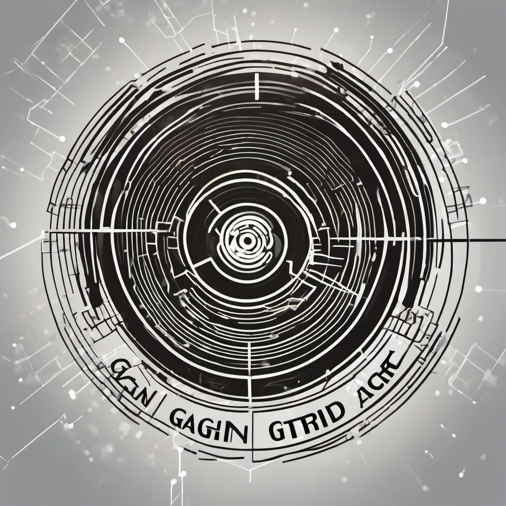

# GAN_GRID
<div id="top"></div>
<!-- PROJECT LOGO -->
<br />
<div align="center">
  <a href="https://github.com/emadef1/GAN_GRID/tree/main">
    
  </a>

  <h1 align="center">GAN_GRID</h1>

  <p align="center">
    GAN-GRID: A Novel Adversarial Attack on Smart Grid Stability Prediction
    <br />
    <a href="https://github.com/emadef1/GAN_GRID/tree/main"><strong>Paper in progress »</strong></a>
    <br />
    <br />
    <a href="">Anonymous Authors</a>
  </p>
</div>

<!-- TABLE OF CONTENTS -->
<details>
  <summary><strong>Table of Contents</strong></summary>
  <ol>
    <li>
      <a href="#abstract">Abstract</a>
    </li>
    <li>
      <a href="#usage">Usage</a>
    </li>
    <li>
      <a href="#models">Models</a>
    </li>
    <li>
      <a href="#baseline">Baseline</a>
    </li>
    <li>
      <a href="#attacks">Attacks</a>
    </li>
  </ol>
</details>

<div id="abstract"></div>

## 🧩 Abstract

>The smart grid represents a pivotal innovation in modernizing the electricity sector, offering an intelligent, digitalized energy network capable of optimizing energy delivery from source to consumer. Central to its operation are goals encompassing grid stability, enhanced power system performance, security, and reduced operational costs. Accurate energy demand prediction is paramount, ensuring optimal energy availability and mitigating costly production or usage errors. Leveraging state-of-the-art machine learning algorithms, including the chosen XGBoost model and a proposed LSTM-based deep learning model, we explore the publicly available smart grid dataset for the stability prediction task. However, the stability of a smart grid is intricately linked to its resilience against cyberattacks. In this study, we propose GAN-GRID a novel adversarial attack targeting the stability prediction system, tailored to real-world constraints. Our findings reveal that an adversary armed solely with the stability model's output, devoid of data or model knowledge, can craft data classified as stable with an Attack Success Rate (ASR) of 0.99. Also by manipulating authentic data and sensor values, the attacker can amplify grid issues, potentially undetected due to a compromised stability prediction system. These results underscore the imperative of fortifying smart grid security mechanisms against adversarial manipulation to uphold system stability and reliability.

<p align="right"><a href="#top">(back to top)</a></p>
<div id="usage"></div>

## ⚙️ Usage

To execute the attacks or to deploy the FaultGuard framework, start by cloning the repository:

```bash
git clone https://github.com/emadef1/GAN_GRID.git
cd GAN_GRID
```
<sup>NOTE: if you're accessing this data from the anonymized repository, the above command might not work..</sup>

Then, install the required Python packages by running:

```bash
pip install -r requirements.txt
```

<p align="right"><a href="#top">(back to top)</a></p>
<div id="models"></div>

